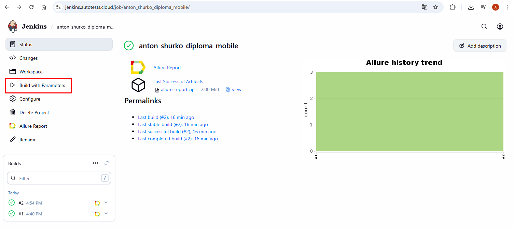
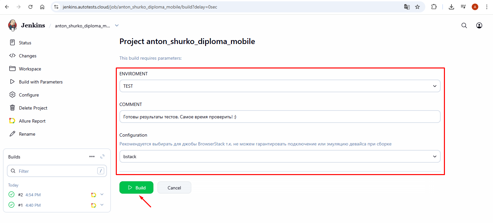
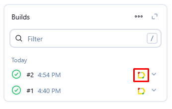
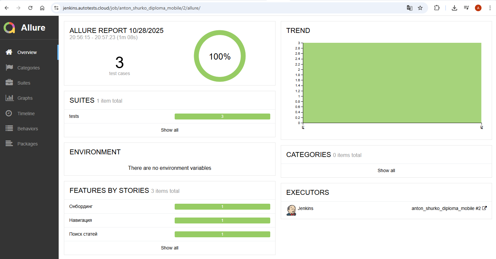

# 🎓 QA.GURU Mobile Wiki Project

*Небольшой проект по автоматизации на основе приложения Wikipedia, базовой проверке нескольких кейсов*
# 
## О проекте

Этот проект является дипломной работой по курсу QA.GURU и представляет собой фреймворк для автоматизации тестирования приложения ["Wikipedia"](https://www.wikipedia.org). В реализации использованы инструменты и библиотеки:

<p  align="center">
  
  
  
  
  
  
  
  
  
  
  


</p>

##  Запуск тестов локально

1) Клонировать репозиторий: git clone https://github.com/ashurko/qa_guru_python_21_diploma_mobile
2) Установить зависимости: pip install -r requirements.txt
3) Запуск тестов с выбором параметра источника запуска тестов: pytest --context={enviroment} (где enviroment = bstack / local_emulator / local_real_device)

##    Создание сборки на удаленном сервере - Jenkins

1) Авторизоваться в Jenkins
2) Перейти в джобу https://jenkins.autotests.cloud/job/anton_shurko_diploma_mobile/
3) Для запуска тестов в Jenkins нажать "Build With Parameters"
4) Выбрать необходимые параметры
5) Нажать Run Build

<p></p>

<p></p>

##  Визуализация результатов (Allure Reports)

Для просмотра результатов тестового запуска в Allure необходимо кликнуть на соответствующую ему иконку

<p></p>
<p></p>


## Если тесты запускались локально, то результаты можно посмотреть командой: 

```bash
allure serve reports/allure-results
```


##  Интеграция с Telegram в Jenkins для автоматической отправки результатов тестового прогона через бота

<p></p>